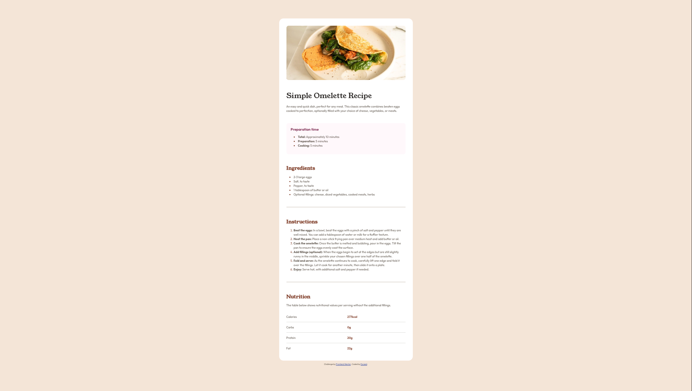

# Frontend Mentor - Recipe page solution

This is a solution to the [Recipe page challenge on Frontend Mentor](https://www.frontendmentor.io/challenges/recipe-page-KiTsR8QQKm). Frontend Mentor challenges help you improve your coding skills by building realistic projects.

## Table of contents

- [Overview](#overview)
  - [The challenge](#the-challenge)
  - [Screenshot](#screenshot)
  - [Links](#links)
  - [My process](#my-process)
  - [Built with](#built-with)
  - [What I learned](#what-i-learned)
  - [Continued development](#continued-development)
  - [Useful resources](#useful-resources)

## Overview

This is a free exercise from [frontendmentor.io] which utilizes the fundamentals of CSS and semantic HTML.

### Screenshot

### Links

- Solution URL: [https://github.com/Exc1D/recipe-page.git]
- Live Site URL: [https://exc1d.github.io/recipe-page/]

## My process

I downloaded the pre-formatted starter code and other necessary files from [frontendmentor.io] which is free by the way. Then I sent the .fig file to [pixso.net] so that I can analyze the properties.

I format the HTML code first then proceed with looking for repetitive CSS attributes. I synthesized these attributes in :root. Styled the rest of the elements then added the final touches of spacing corrections.

### Built with

- Semantic HTML5 markup
- CSS custom properties
- Flexbox

### What I learned

I learned to use :root pseudo-class to gather the repetitive attributes.

### Useful resources

- [pixso.net]- this app has a free dev mode that can be used to analyze specific CSS properties that were otherwise a paid feature in figma.
